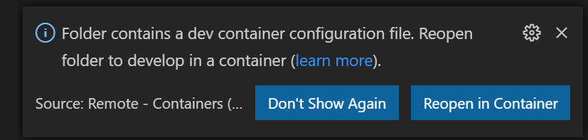
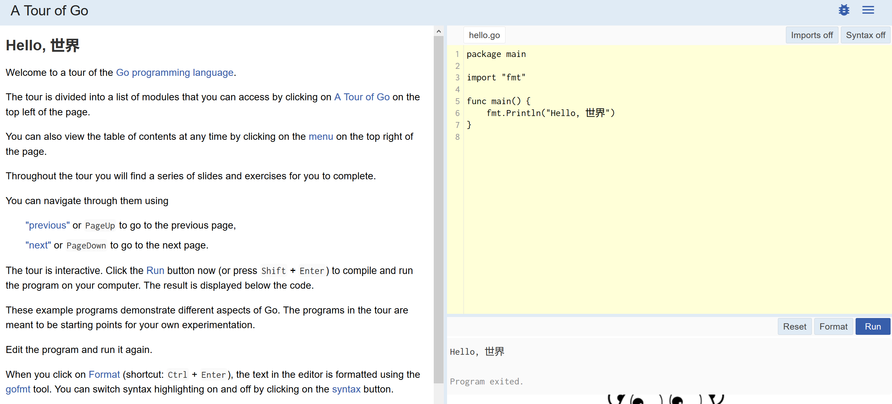

 

#  Golang Bits n Bytes

## Voorbereiding

De opdrachten kunnen op verschillende manieren uitgevoerd worden:

- Visual Studio Code & Docker
- gitpod.io
- Eigen installatie

### Visual Studio Code & Docker

1. [Visual Studio Code](https://code.visualstudio.com/) + [Remote Development](https://marketplace.visualstudio.com/items?itemName=ms-vscode-remote.vscode-remote-extensionpack) extensie
2. [Docker](https://www.docker.com/)

Visual Studio Code start automatisch een Docker container met daarin alle benodigde tools. Om commando's in te tikken moet gebruik worden gemaakt van de ingebouwde terminal van Visual Studio Code.

Open de folder in Visual Studio Code. Hierna vraagt Visual Studio Code om de container te bouwen en te starten.

### gitpod.io

Deze repository is te openen via gitpod.io door op deze link te klikken: https://gitpod.io/#https://github.com/ninckblokje/golang-bits-n-bytes. Hiervoor is een GitHub account nodig.

De tour werkt (nog) niet via gitpod.io.

### Eigen installatie

Installeer Golang, TinyGo (optioneel) en Java (optioneel):

1. Download Golang versie 1.14.x van: <https://golang.org/>
1. Download TinyGo versie 0.13.1 van: <https://tinygo.org/>
1. Download Java versie 11.x van: <https://adoptopenjdk.net/>

## Tour

Golang heeft een eigen tour die lokaal gedraaid kan worden:

1. Open een terminal
2. Tik in het commando `tour -http=localhost:3999`
3. Open een browser op: http://localhost:3999

## Opzet Bits n Bytes

1. De folder [intro](intro/intro.md) bevat een introductie tot Golang.
1. De folder [tinygo](tinygo/tinygo.md) bevat een voorbeeld van TinyGo met WebAssembly
1. De folder [RESTService](RESTService/objectives.md) bevat een opdracht voor het bouwen van een eigen REST service